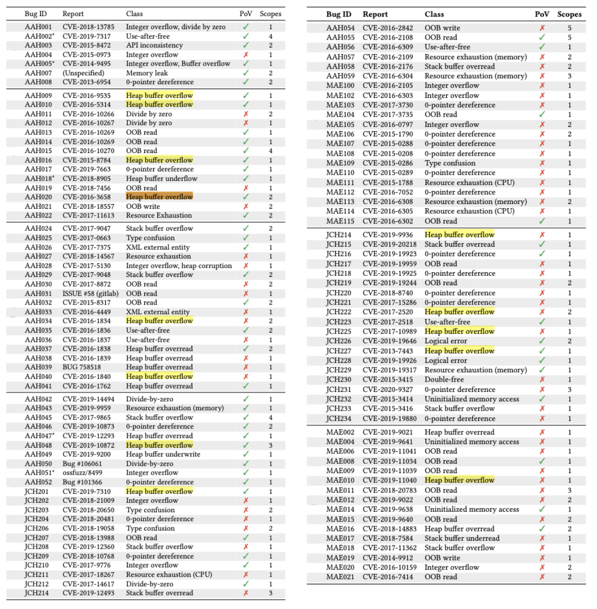

# MAGMA MTE Workflow Notes

This branch adds local helper scripts for building `poppler` and `libtiff`
with AFL++ and ASan on `aarch64`, plus batch triage scripts for replaying PoC
files.



The commands below assume:

- repo root: `$MAGMA_ROOT`
- shell: `bash`
- architecture: `aarch64`

## 1. Common setup

```bash
export MAGMA_ROOT=/path/to/magma
cd "$MAGMA_ROOT"
```

Install target dependencies:

```bash
bash targets/poppler/preinstall.sh
bash targets/libtiff/preinstall.sh
```

Apply MAGMA patches after each target has been fetched:

```bash
export TARGET="$PWD/targets/<target-name>"
bash "$PWD/magma/apply_patches.sh"
```

## 2. Bundled PoCs and their source

This repository now includes the PoCs used in this workflow:

- `targets/libtiff/poc/AAH009`
- `targets/libtiff/poc/AAH010`
- `targets/libtiff/poc/AAH016`
- `targets/libtiff/poc/AAH020`
- `targets/poppler/poc/JCH201`

Most of these PoCs come from the official MAGMA OSF archive provided via:

- Overview: `https://osf.io/resj8/overview`
- File bundle: `https://osf.io/resj8/files/9bnfd`

The local image `magma_poc.png` is included to show the bundled PoC layout used
by this branch.

## 3. Build poppler with AFL++ and ASan

Fetch source:

```bash
cd "$MAGMA_ROOT"
export TARGET="$PWD/targets/poppler"
bash "$TARGET/fetch.sh"
bash "$PWD/magma/apply_patches.sh"
```

Build:

```bash
mkdir -p "$TARGET/out_fuzz_asan"
OUT="$TARGET/out_fuzz_asan" TARGET="$TARGET" \
  bash "$TARGET/build_fuzz_asan.sh"
```

Built binaries:

- `targets/poppler/out_fuzz_asan/pdf_fuzzer`
- `targets/poppler/out_fuzz_asan/pdfimages`
- `targets/poppler/out_fuzz_asan/pdftoppm`

Run a single sample:

```bash
ASAN_OPTIONS='abort_on_error=1:symbolize=1:detect_leaks=0' \
  targets/poppler/out_fuzz_asan/pdf_fuzzer /path/to/sample.pdf
```

```bash
ASAN_OPTIONS='abort_on_error=1:symbolize=1:detect_leaks=0' \
  targets/poppler/out_fuzz_asan/pdfimages /path/to/sample.pdf /tmp/out
```

```bash
ASAN_OPTIONS='abort_on_error=1:symbolize=1:detect_leaks=0' \
  targets/poppler/out_fuzz_asan/pdftoppm -mono -cropbox /path/to/sample.pdf
```

Run the bundled poppler PoCs:

```bash
ASAN_OPTIONS='abort_on_error=1:symbolize=1:detect_leaks=0' \
  targets/poppler/out_fuzz_asan/pdfimages \
  targets/poppler/poc/JCH201/moptafl_poppler_pdfimages_JCH201.L0C /tmp/out
```

```bash
ASAN_OPTIONS='abort_on_error=1:symbolize=1:detect_leaks=0' \
  targets/poppler/out_fuzz_asan/pdftoppm -mono -cropbox \
  targets/poppler/poc/JCH201/moptafl_poppler_pdftoppm_JCH201.RCT
```

## 4. Build libtiff with AFL++ and ASan

Fetch source:

```bash
cd "$MAGMA_ROOT"
export TARGET="$PWD/targets/libtiff"
bash "$TARGET/fetch.sh"
bash "$PWD/magma/apply_patches.sh"
```

Build:

```bash
mkdir -p "$TARGET/out_fuzz_asan"
OUT="$TARGET/out_fuzz_asan" TARGET="$TARGET" \
  bash "$TARGET/build_fuzz_asan.sh"
```

Built binaries:

- `targets/libtiff/out_fuzz_asan/tiff_read_rgba_fuzzer`
- `targets/libtiff/out_fuzz_asan/tiffcp`

Run a single sample:

```bash
ASAN_OPTIONS='abort_on_error=1:symbolize=1:detect_leaks=0' \
  targets/libtiff/out_fuzz_asan/tiff_read_rgba_fuzzer /path/to/sample.tif
```

```bash
ASAN_OPTIONS='abort_on_error=1:symbolize=1:detect_leaks=0' \
  targets/libtiff/out_fuzz_asan/tiffcp -M /path/to/sample.tif /tmp/out.tif
```

Run one bundled libtiff PoC:

```bash
ASAN_OPTIONS='abort_on_error=1:symbolize=1:detect_leaks=0' \
  targets/libtiff/out_fuzz_asan/tiff_read_rgba_fuzzer \
  targets/libtiff/poc/AAH010/moptafl_libtiff_tiff_read_rgba_fuzzer_AAH010.x6L
```

## 5. Batch replay libtiff PoCs

Replay only `tiff_read_rgba_fuzzer`:

```bash
bash targets/libtiff/run_poc_batch_rgba.sh
```

Replay both `tiff_read_rgba_fuzzer` and `tiffcp`:

```bash
bash targets/libtiff/run_poc_batch_both.sh
```

To use a different PoC directory, pass it explicitly:

```bash
bash targets/libtiff/run_poc_batch_both.sh /path/to/tiff_poc /tmp/tiff_poc_both_logs
```

Main outputs:

- `summary.tsv` or `summary_long.tsv`
- `summary_wide.tsv`
- raw logs under `logs_rgba/` and `logs_tiffcp/`

For `heap-buffer-overflow`, `run_poc_batch_both.sh` records:

- `access_size`: ASan access size
- `boundary_distance`: distance reported by ASan from the object boundary
- `oob_bytes`: inferred number of bytes accessed out of bounds

## 6. MAGMA canary workflow for libtiff

The scripts in this branch focus on ASan replay. If you want MAGMA canary
checking instead, use the normal MAGMA build flow and `runonce.sh`.

Typical replay command:

```bash
cd "$MAGMA_ROOT"
OUT=/tmp/magma_iso_libtiff/targets/libtiff/out_magma_canary
PROGRAM=targets/libtiff
POC=/path/to/sample.tif

bash magma/runonce.sh "$OUT" "$PROGRAM" "$POC"
```

`runonce.sh` invokes `monitor` internally. That path reports MAGMA canary hits,
not ASan byte-accurate overflow sizes.

## 7. Notes

- `targets/poppler/build.sh` now disables freetype brotli and resolves
  `ICONV_LIBRARIES` from the active multiarch path, which is required on
  `aarch64`.
- The repository root `.gitignore` excludes local build outputs, cloned target
  repos, and temporary objects so local compilation does not pollute git state.
